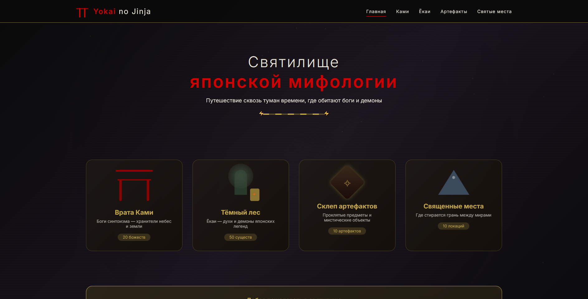
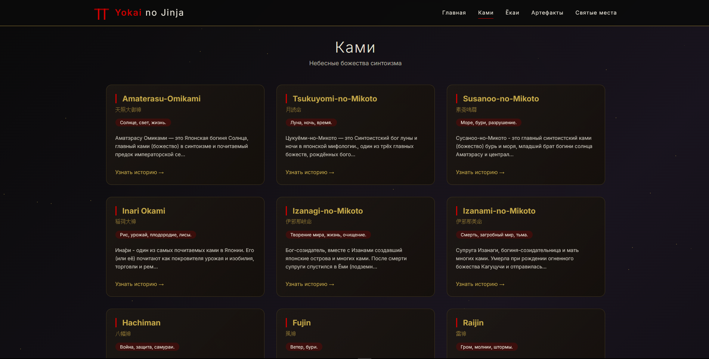
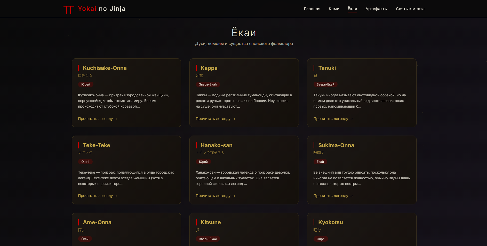
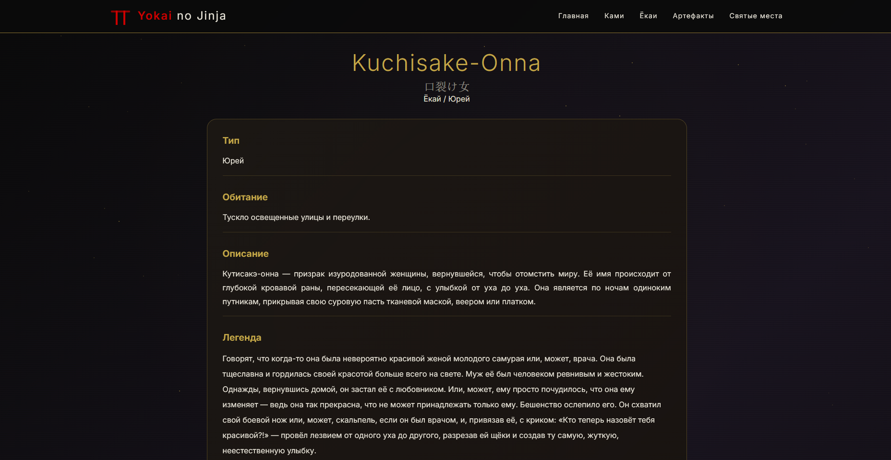

#  Yōkai no Jinja


---

## О проекте

Yōkai no Jinja — это интерактивное святилище японской мифологии.
Здесь обитают ками, ёкаи и древние сущности, чьи истории собраны в едином архиве.

---

## Превью

<p align="center">
  
  
</p>

<p align="center">
  
  
</p>

---

##  Технологии

* PHP
* MySQL
* HTML / CSS
* JavaScript

---

##  Запуск

### Способ 1 — Через XAMPP

1. Скачать проект (ZIP с GitHub)

2. Распаковать в папку:

   ```
   xampp/htdocs/yokai-no-jinja
   ```

3. Запустить:

   * Apache
   * MySQL

4. Импортировать базу данных (sql/mythology.sql) через phpMyAdmin( http://localhost/phpmyadmin/index.php )

5. Открыть сайт:

   ```
   http://localhost/yokai-no-jinja/index.php
   ```

---

### Способ 2 — Через Git
git clone https://github.com/soykoulen/Yokai-no-JinjaRUS.git
cd yokai-no-jinja

Далее:

1. Переместить проект в htdocs
2. Запустить Apache + MySQL
3. Импортировать базу данных
4. Настроить подключение
5. Открыть в браузере

---

##  Как это работает

База данных хранит:

* ками
* ёкаев
* артефакты
* священные места

И связи между ними.

Сайт:

1. Получает данные
2. Обрабатывает связи
3. Генерирует карточки

---

## Это святилище является новой формой архива **[Noroi no Kiroku](https://github.com/soykoulen/Noroi-no-KirokuRUS)**
## **Скоро будет перевод репозитория на английский язык, из-за экзаменов активничать не получается**
---
